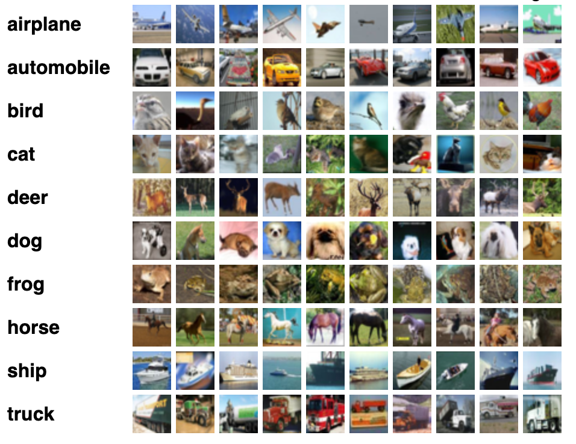

# 🧠 CIFAR-10 Image Classification with PyTorch

This project implements a Convolutional Neural Network (CNN) using **PyTorch** to classify images from the **CIFAR-10** dataset. The model architecture includes multiple convolutional layers, batch normalization, dropout, and uses the Adam optimizer with cross-entropy loss.

---

## 📊 Outputs

During training, loss and accuracy are plotted and saved under the `outputs/` directory

---

## 🧱 Model Architecture

The model is a CNN with 3 convolutional blocks followed by a classifier:

- **Conv2d → BatchNorm2d → ReLU → Conv2d → BatchNorm2d → ReLU → MaxPool**
- **Dropout + Linear Layers with BatchNorm and ReLU**
- Total parameters: ~1.2M

---

## 📦 Dataset: CIFAR-10

- 60,000 32x32 RGB images in 10 classes
- 50,000 training images and 10,000 test images
- Automatically downloaded from `torchvision.datasets.CIFAR10`

---
